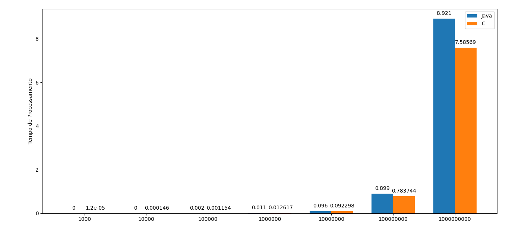

# Comparativo de desempenho do Java e da Linguagem C no cálculo de divisores
Para realizar este comparativo de desempenho foi utilizado a linguagem Python versão
3.7.10 para automação de execução pareada de código Java e C, coleta das saídas dos
código, armazenamento em arquivos csv e geração de gráficos com Matplotlib versão
3.5.2.


### Instalação de Bibiotecas:
```
pip3 install -r requirements.txt 
```

## Gráfico Gerado:


